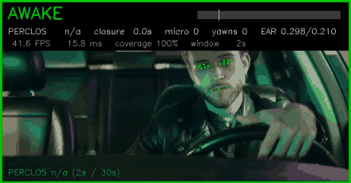
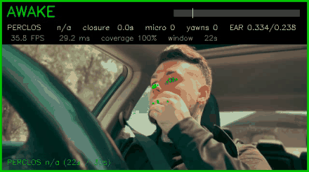

# Driver Drowsiness Detection

Real-time driver drowsiness monitoring from a single camera, built around a
**temporal decision layer** rather than per-frame classification.

A closed eye in one frame is a blink. A closed eye for 900 ms is a
microsleep. They look identical to an image classifier. This project
measures the difference.



*Night driving, tired driver: WARNING at 4.3 s after the first long closure,
ALARM at 15.7 s after the third microsleep.*



*Same system, alert driver, 54 s clip: no alert raised. PERCLOS 0.7 %, well
below the 15 % threshold.*

---

## Why per-frame detection is not enough

Most open-source drowsiness projects train a detector on "open eye" vs
"closed eye" and raise an alarm when the closed class appears. That design
cannot work, for a reason that has nothing to do with model accuracy:

| Event | Eye closed for | Looks like |
|---|---|---|
| Normal blink | 100–400 ms | closed eye |
| Long blink | 400–500 ms | closed eye |
| **Microsleep** | **> 500 ms** | closed eye |
| Sleep onset | seconds | closed eye |

Drowsiness is a property of a **time series**, not of an image. The automotive
industry measures it with **PERCLOS** — the percentage of time the eyes are
closed over a sliding window — established by the NHTSA as the reference
correlate of driver impairment, with a threshold around 15 % over 60 seconds.

This project implements that layer, and makes it **interchangeable** between
two different frontends so they can be compared on equal footing.

```
             ┌──────────────────────────┐
  camera ──► │ frontend (per frame)     │
             │  A. YOLOv8n  (learned)   │
             │  B. MediaPipe (geometric)│
             └────────────┬─────────────┘
                          │  eye state + mouth state, timestamped
                          ▼
             ┌──────────────────────────┐
             │ DrowsinessMonitor        │
             │  PERCLOS, microsleeps,   │
             │  yawns, blink rate,      │
             │  hysteresis, gap filling │
             └────────────┬─────────────┘
                          │  AWAKE / WARNING / DROWSY
                          ▼
             ┌──────────────────────────┐
             │ AlertManager             │
             │  graduated, non-blocking │
             └──────────────────────────┘
```

---

## Results

### 1. The dataset was the bottleneck, not the model

The starting point was a public Roboflow dataset: 9 694 images, 11 classes,
11 819 annotations. A first model trained on it reached **mAP@50 = 0.514**
with a precision of **0.372**.

Auditing the annotations explained why. Measuring the median box area per
class revealed that the 11 classes sat at four incompatible scales:

| Scale | Classes | Median box area |
|---|---|---|
| Eye | `Attentive eye`, `open`, `Drowsy eye` | 0.5 – 2.7 % |
| Mouth | `Open-Mouth`, `yawn` | 1.7 – 1.9 % |
| Face region | `Eyeclosed`, `Yawn`, `noYawn` | 10 – 11 % |
| Whole face | `close` | 36 % |

`Eyeclosed` and `closed` mean the same thing in English but annotate regions
that differ by a factor of ten. `Yawn` (10.4 %) and `yawn` (1.7 %) have almost
identical counts but annotate a face and a mouth respectively. Three
face-level classes contradict each other: a driver yawning with eyes closed is
simultaneously `Eyeclosed`, `Yawn` and not `noYawn`.

Visual inspection confirmed it and found more: `noYawn` samples showing
obvious yawns, and an `asleep` class containing a scanned magazine page and a
rear-view mirror reflection.

**Cleaning:** drop the face-level and garbage classes, drop close-up eye
crops (box area > 15 % of the image), merge synonyms, and re-split 70/20/10
**stratified per class** — the original split left `mouth_open` entirely
absent from validation and test.

Result: 4 163 images, 7 148 annotations, 3 coherent classes, all at the same
scale. The full audit is in
[`notebooks/dataset_audit.ipynb`](notebooks/dataset_audit.ipynb).

### 2. Model iterations

`yolov8n`, 640 px, batch 32, 80 epochs with early stopping, `seed=42`,
`deterministic=True`. Trained on a Tesla T4.

| Version | Classes | P | R | mAP@50 | mAP@50-95 |
|---|---|---|---|---|---|
| v2 (original dataset) | 11 | 0.372 | 0.814 | 0.514 | 0.311 |
| v3 (cleaned) | 4 | 0.565 | 0.854 | 0.698 | 0.430 |
| **v4 (final)** | **3** | **0.858** | **0.780** | **0.866** | **0.526** |

Per class, v4:

| Class | P | R | mAP@50 | mAP@50-95 |
|---|---|---|---|---|
| `eye_open` | 0.957 | 0.664 | 0.889 | 0.485 |
| `eye_closed` | 0.887 | 0.683 | 0.874 | 0.496 |
| `mouth_open` | 0.730 | 0.994 | 0.835 | 0.597 |

**These numbers are not directly comparable across rows** — fewer classes is
a mechanically easier problem. The informative comparison is per class:
`eye_open` and `eye_closed` barely moved between v3 and v4 (0.886 → 0.889 and
0.872 → 0.874), while `mouth_open` went from **0.377 to 0.835**.

That jump came from removing the `yawn` class entirely. A yawn *is* an open
mouth; the two are not separable in a still frame, and forcing the detector to
choose was costing it two thirds of its precision on that class. The yawn is
now reconstructed in the temporal layer from how long the mouth stays open.

### 3. Temporal layer

Validated on three clips, all correct:

| Clip | Content | Output |
|---|---|---|
| Night driving, tired driver | 3 closures > 0.6 s | WARNING 4.3 s, ALARM 15.7 s |
| Daytime, alert driver, 54 s | none | **no alert** |
| Severe fatigue | 7.6 s closure | WARNING 0.5 s, ALARM 3.9 s |

The negative case matters as much as the positives. A system that fires
constantly would also "detect" fatigue, and be useless.

On the 54 s clip the PERCLOS window finally filled and reported **0.7 %**,
far below the 15 % threshold — the first run in which PERCLOS became a valid
measurement rather than an estimate on a partial window.

The decision layer has no dependency on OpenCV, PyTorch or MediaPipe. It takes
timestamps and states, returns a decision, and is tested standalone:

```bash
python src/drowsiness_state.py
```

### 4. Frontend comparison

Same clips, same decision layer, CPU only (Intel i5-8350U, 4 cores, 1.7 GHz).

| | YOLOv8n | MediaPipe |
|---|---|---|
| Inference p50 | 58 – 110 ms | 10 – 23 ms |
| Real-time at 25 fps (40 ms budget) | no | yes |
| Face lost (night clip) | 51 % of frames | 0 % after calibration fix |
| Training data required | 4 163 annotated images | none |
| Retrainable on new conditions | yes | no |

**Agreement between the two, when both produce a detection: 89 %**
(101 / 113 frames). Disagreements are asymmetric: MediaPipe calls "closed"
11 times where YOLO says "open", the reverse only once. MediaPipe is
systematically more sensitive to eyelid closure.

The latency figures are given as ranges on purpose. Repeated runs of the same
model on the same frames varied by a factor of two between sessions on this
laptop (58 ms and 110 ms, both passing intra-run drift checks). The machine's
thermal and background state dominates at this scale. The ranges are honest; a
single decimal figure would not be.

Even at the most favourable YOLO figure, MediaPipe is three times faster.

### 5. What did not work

Exporting the YOLO model to a CPU-optimised runtime, a standard optimisation
that usually buys 2–4×:

| Backend | p50 | vs PyTorch |
|---|---|---|
| PyTorch | 58 ms | 1.00× |
| ONNX Runtime | 64 ms | 0.91× |
| OpenVINO | 57 ms | 1.02× |

**No meaningful gain.** PyTorch already dispatches to Intel's optimised
kernels on this CPU, so there is nothing left for another runtime to recover.
ONNX Runtime is measurably *slower*.

The exports are faithful, which is what makes the negative result
trustworthy: **98.2 % of detections matched** the PyTorch baseline at
IoU ≥ 0.9, with a mean confidence difference of 0.005. The speedup is absent,
not hidden behind a behaviour change.

An early version of this benchmark reported OpenVINO at 37 ms — a 1.6×
speedup. It was wrong. Running backends sequentially let thermal throttling
penalise whichever ran last, and OpenVINO's internal queueing produced a
bimodal distribution whose median measured only the fast calls. The benchmark
now isolates each backend in its own process and aborts if the machine's speed
drifts more than 15 % during a run.

---

## Alerting

Graduated, never startling. A sudden loud alarm makes a drowsy driver jerk the
wheel.

| Level | Trigger | Response |
|---|---|---|
| WARNING | first closure > 500 ms | soft 660 Hz chime + spoken suggestion |
| ALARM | 3 microsleeps, or one closure > 1.5 s | firmer 880 Hz chime + instruction to pull over |

Design constraints:

- **Never blocks the inference loop.** Sound is dispatched to a worker thread
  through a queue. An earlier implementation called `winsound.Beep()` inline,
  which froze the loop for 100 ms per frame while the alarm sounded, dropping
  the system to ~10 FPS exactly when it needed to be responsive.
- **Chimes are generated, not shipped.** A sine with a 40 ms fade in/out; a raw
  sine starting at full amplitude clicks.
- **Cooldowns per severity**, so the system never speaks every frame.
- **Leaving the alarm requires an event.** The alarm latches, as real systems
  do, and releases either on sustained quiet or on driver acknowledgement
  (press `a`). An earlier version latched with no release path at all.
- **Messages push the driver to stop**, never to keep going. The only effective
  countermeasures to drowsiness are caffeine and a short nap; a system that
  keeps a driver awake by talking encourages them to continue driving.
- **Degrades gracefully.** No TTS engine, no audio device, headless container:
  messages print to console and the pipeline keeps running.

---

## Quickstart

```bash
git clone https://github.com/AYMANE-SNOUSSI/driver-drowsiness-detection.git
cd driver-drowsiness-detection
python -m venv .venv && .venv\Scripts\activate     # Windows
pip install -r requirements.txt

# MediaPipe landmark model (~3.7 MB)
curl -o face_landmarker.task https://storage.googleapis.com/mediapipe-models/face_landmarker/face_landmarker/float16/1/face_landmarker.task
```

YOLO weights are in [Releases](../../releases); place `drowsy_v4.pt` in `models/`.

```bash
# MediaPipe frontend, with alerts
python src/run_mediapipe.py --video data/clip.mp4 --tag demo --alerts

# YOLO frontend, same decision layer
python src/run_yolo.py --video data/clip.mp4 --tag yolo

# decision layer alone (unit tests, no model, no video)
python src/drowsiness_state.py

# backend latency measurement
python src/bench_one.py --backend openvino --warmup 60 --skip-first 25
```

Each run writes an annotated video and a per-frame CSV to `runs/`.
During playback, `a` acknowledges the alarm and `q` quits.

---


## Modules

| File | Role |
|---|---|
| `src/drowsiness_state.py` | The core. Takes one observation per frame (eye open/closed, mouth open, timestamp) and decides AWAKE / WARNING / DROWSY. Computes PERCLOS over a sliding window, detects microsleeps and yawns by duration, handles hysteresis and dropped detections. Depends on nothing — no OpenCV, no PyTorch, no MediaPipe — which is why the same decision logic can be driven by either frontend, and why it can be unit-tested on its own. |
| `src/alerts.py` | Turns a decision into a response: soft chime at WARNING, firmer chime plus a spoken instruction at ALARM. Audio runs on a worker thread so it never blocks inference. Falls back to console output when no TTS engine or audio device is available. |
| `src/run_mediapipe.py` | Frontend A. Extracts 478 facial landmarks per frame and derives eye and mouth opening from geometric ratios (EAR / MAR). Calibrates the closed-eye threshold per driver in a first pass, then processes the whole clip. Needs no training data. |
| `src/run_yolo.py` | Frontend B. Runs the trained YOLOv8n detector and maps its boxes to the same eye/mouth states. Same CLI, same CSV output as the MediaPipe runner, so the two can be compared frame by frame. |
| `src/bench_one.py` | Measures inference latency for one backend, alone in its own process. Reports p50, p95 and spread, and flags the run if the machine's speed drifted during the measurement. |
| `src/bench_backends.py` | Exports the model to ONNX and OpenVINO, then verifies the exports predict the same thing as PyTorch (IoU matching, confidence delta). A faster model that behaves differently is not an optimisation. |
| `notebooks/dataset_audit.ipynb` | How the dataset was diagnosed and rebuilt: class-scale measurement, visual inspection, filtering, stratified re-split, and the three training runs. |

```
driver-drowsiness-detection/
├── src/                  # pipeline and benchmarks
├── notebooks/            # dataset audit
├── assets/               # demo GIFs
├── models/               # weights (see Releases, not versioned)
├── data/                 # test clips (not versioned)
└── runs/                 # outputs (not versioned)
```

---

## Limitations

Measured, not guessed.

- **Calibration assumes the driver is alert at startup.** The EAR baseline is
  learned from the opening seconds. On the severe-fatigue clip the driver was
  already half-lidded, and the baseline came out at 0.195 against 0.291 and
  0.330 on the other two clips. It still worked because closures reached
  0.035, but a milder case could be missed.
- **PERCLOS needs 30 s of observation** before it is comparable to the NHTSA
  definition. The system reports `n/a` below that and falls back on microsleep
  counting, which needs no window. Clips shorter than 30 s never produce a
  valid PERCLOS.
- **YOLO loses the face when the head turns.** 51 % of frames on the night
  clip, including one gap of 5 consecutive seconds. The training data is
  mostly frontal. MediaPipe does not have this failure mode on the same clip.
- **No infrared.** An RGB camera fails at night without cabin lighting and
  cannot see through sunglasses. Real driver-monitoring systems use 940 nm
  near-infrared for exactly this reason.
- **Latency measured on one laptop CPU**, with a factor-of-two variance
  between sessions. No embedded target has been benchmarked.
- **Validated on three clips.** That is a sanity check, not an evaluation.
  Reference datasets (UTA-RLDD, NTHU-DDD, YawDD) would make the numbers
  comparable to published work.
- **Single face only.** `num_faces=1`; a passenger in frame is not handled.

---

## Next steps

**Evaluation.** Run the full pipeline on UTA-RLDD or NTHU-DDD, which provide
labelled drowsiness levels and let PERCLOS be validated against ground truth
rather than inspected by eye.

**Embedded target.** The architecture is chosen with this in mind, and the
camera matters as much as the compute:

| Target | Expected | Note |
|---|---|---|
| Raspberry Pi 5 + MediaPipe | to be measured | most likely candidate |
| Raspberry Pi 5 + YOLOv8n NCNN | to be measured | needs int8 quantisation |
| Jetson Orin Nano | to be measured | comfortable headroom |

Sensor: Raspberry Pi Camera **NoIR** with 940 nm illuminators. Invisible to
the driver, unaffected by cabin lighting, and passes through most sunglasses.

**Model.** Two avenues the runtime exports could not reach, because they change
the model rather than its executor: int8 quantisation, and retraining at
320 px instead of 640.

**Head pose.** MediaPipe returns a 3D face transform. Nodding is an
independent drowsiness signal and the landmarks to compute it are already
being extracted.

---

## Data and licensing

**Training dataset:** Roboflow `kara-aawmz/drowsiness-driver-sw14t`, v1.
The cleaning pipeline in `notebooks/dataset_audit.ipynb` reproduces the
3-class dataset from the original.

**Demo clips**, both from [Pexels](https://www.pexels.com) under the Pexels
licence:

- Night driving — Ron Lach
  <https://www.pexels.com/fr-fr/video/homme-voiture-conduire-fatigue-9531464/>
- Daytime driving — melbourne ross
  <https://www.pexels.com/fr-fr/video/un-jeune-homme-conduit-avec-le-toit-ouvrant-ouvert-par-temps-ensoleille-32929831/>

**Code:** MIT, see [LICENSE](LICENSE).

---

## Safety notice

This is a **technical demonstration, not a certified driver monitoring
system**. It has not been validated against any automotive safety standard,
and must not be relied upon while driving.

No alerting strategy replaces stopping to rest.

---

## Author

**Aymane Snoussi** — MSc in Artificial Intelligence & Computer Vision,
Université de Poitiers.

[LinkedIn](https://www.linkedin.com/in/aymane-snoussi-538561335/) · [GitHub](https://github.com/AYMANE-SNOUSSI)
