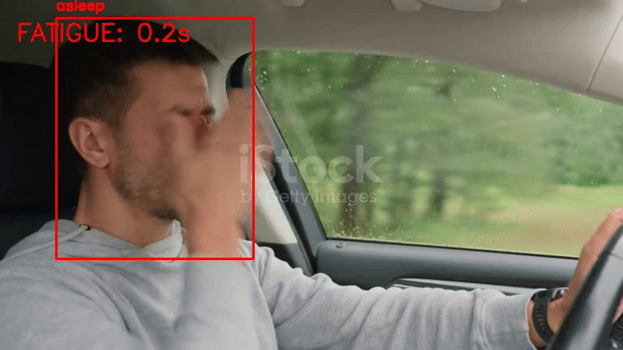

# 🚗 Real-Time Driver Drowsiness Detection System


## 📋 Overview

Fatigue is a major cause of road accidents. This project implements a **Real-Time Driver Drowsiness Detection System** using Computer Vision and Deep Learning.

Unlike traditional methods based on simple eye aspect ratios (EAR), this system uses a fine-tuned **YOLOv8 Nano** model trained on a diverse dataset of drivers. It is capable of detecting specific behaviors such as yawning, drowsy eyes, and closed eyes in variable lighting conditions.

### 🎥 Demo


*(The system detecting fatigue signs and triggering the "DANGER" alert)*

## ✨ Key Features

* **⚡ Real-Time Inference:** Optimized for speed using YOLOv8n (Nano).
* **🧠 Custom Training:** Trained on **9,000+ images** covering 11 distinct classes (e.g., `Yawn`, `Drowsy eye`, `Open-Mouth`).
* **🚨 Smart Alarm System:**
    * **Visual Alert:** Red flashing warning on screen.
    * **Audio Alert:** Triggers a sound alarm if fatigue persists for more than **2 seconds**.
* **🛡️ Robustness:** Works with glasses, different angles, and partial occlusions.

## 📂 Project Structure

```text
sleep_detection/
│
├── data/                  # Source videos for testing
├── models/
│   └── drowsy_v2.pt       # The custom trained YOLOv8 model weights
├── notebooks/
│   └── Preprocessing.ipynb # Notebook used for data preparation
├── src/
│   ├── inference.py       # Main script for Webcam/OBS detection
│   └── video_demo.py      # Script to process video files and save output
├── requirements.txt       # List of python dependencies
└── README.md              # Project documentation